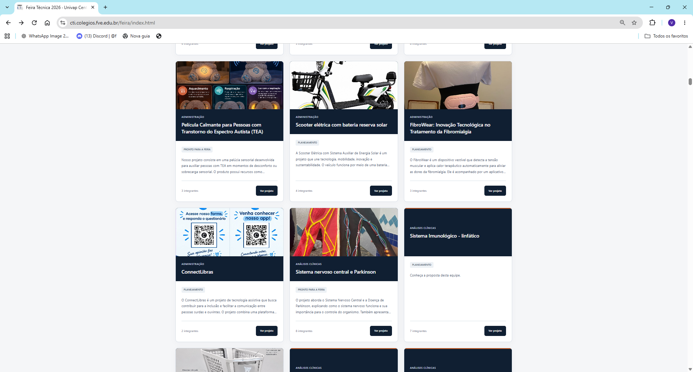
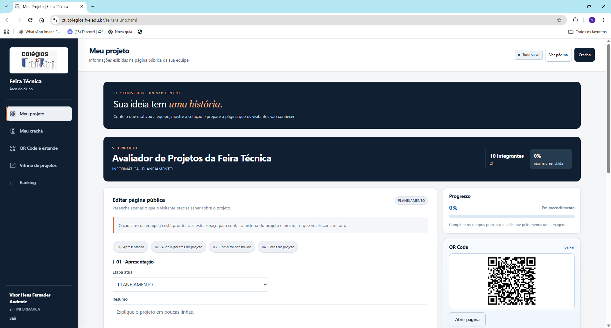
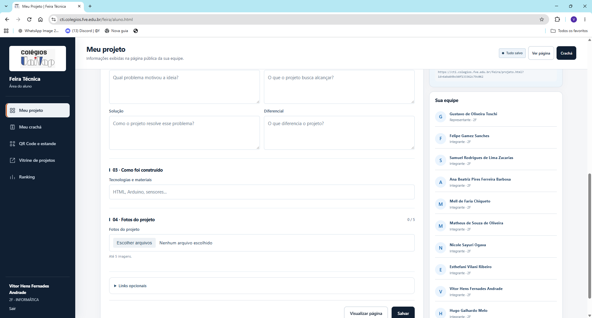
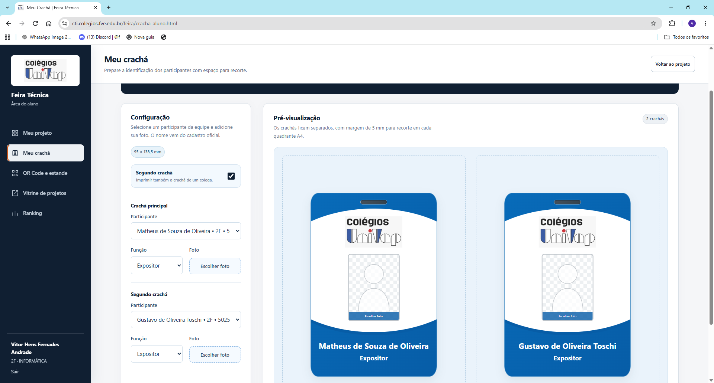

# Feira Técnica 2026 · Colégios Univap

> Plataforma web utilizada na **Univap Centro** para organizar e apresentar os projetos da Feira Técnica.

O sistema reúne, em um só lugar, o catálogo dos trabalhos, a apresentação das equipes, as avaliações da banca e a votação dos visitantes. Também oferece ferramentas para preparar a participação na feira, como crachás e QR Codes que levam diretamente à página de cada projeto.

Desenvolvido como projeto acadêmico de Informática, conecta o trabalho dos alunos à experiência de professores, visitantes e organizadores. **Foi utilizado na escola Univap Centro e continua em evolução.**

## Visão geral

| Item | Descrição |
| --- | --- |
| Contexto | Feira Técnica dos Colégios Univap — unidade Centro |
| Objetivo | Centralizar a apresentação, a organização e a avaliação dos projetos |
| Público | Alunos, professores avaliadores, visitantes e administradores |
| Aplicação | Sistema web com interface responsiva e áreas de acesso por perfil |
| Tecnologias principais | Node.js, Express, MongoDB, JavaScript, HTML e CSS |
| Estado | Utilizado na escola; desenvolvimento e melhorias contínuas |

## Telas do sistema

As capturas abaixo mostram o projeto no ambiente da Univap Centro. Foram organizadas por funcionalidade para apresentar o fluxo de uso.

### 1. Vitrine de projetos

O catálogo público apresenta os trabalhos em cartões com imagem, curso, etapa de desenvolvimento, resumo e acesso à página do projeto. A busca e os filtros ajudam o visitante a encontrar os trabalhos de interesse.



### 2. Área do aluno

O painel reúne as ferramentas da equipe: edição da página pública, acompanhamento do preenchimento e acesso ao QR Code do projeto. A apresentação é organizada em etapas para explicar a ideia e o que foi construído.



### 3. Edição da apresentação

Os alunos autorizados podem descrever o problema, os objetivos, a solução, o diferencial, as tecnologias e os materiais utilizados, além de incluir fotos e links. O painel também permite consultar a equipe e salvar as informações da página pública.



### 4. Crachás dos participantes

A tela permite selecionar os integrantes, definir a função, adicionar uma foto e visualizar os crachás antes da impressão. É possível preparar dois crachás com margens de recorte em uma folha A4.



### 5. QR Code e placa do estande

Cada projeto possui um QR Code que direciona à sua apresentação pública. A placa pode ser impressa para o estande, facilitando o acesso pelo celular durante a visita.


## Como o sistema funciona

1. **A organização prepara a feira:** cadastra ou importa projetos, participantes e avaliadores, além de configurar o período da votação.
2. **As equipes apresentam seus trabalhos:** completam a página pública com resumo, objetivos, solução, tecnologias, fotos e links.
3. **Os participantes preparam os materiais:** geram os crachás e os QR Codes que serão utilizados nos estandes.
4. **Os visitantes conhecem os projetos:** navegam pelo catálogo ou acessam as apresentações pelos QR Codes e podem votar no período autorizado.
5. **A banca avalia os trabalhos:** registra avaliações, enquanto o sistema disponibiliza histórico e rankings.

## Perfis de acesso

| Perfil | Principais recursos |
| --- | --- |
| Visitante | Consultar o catálogo e as páginas públicas; votar quando a votação estiver liberada |
| Aluno | Editar a apresentação da própria equipe, adicionar fotos e preparar crachás e QR Codes |
| Professor avaliador | Acessar a área de avaliação, registrar avaliações e consultar os recursos da banca |
| Administrador | Gerenciar cadastros, importações, projetos e configurações da votação |

Os acessos de aluno, avaliador e administrador são separados e protegidos por autenticação e validação de permissões.

## Funcionalidades

- **Apresentação dos projetos:** catálogo com busca e filtros, páginas públicas e edição pelas equipes autorizadas.
- **Avaliação e resultados:** avaliações da banca, histórico e ranking; votação de visitantes com período configurável e códigos opcionais.
- **Materiais da feira:** geração de QR Codes, placas dos estandes e crachás.
- **Organização:** cadastro e importação de professores por CSV, além de importação privada de projetos e participantes.
- **Experiência de uso:** interface responsiva para computador e celular.
- **Controle de acesso:** proteção de rotas, cookies de sessão, limite de tentativas de login e validações.

## Tecnologias

| Camada | Tecnologias |
| --- | --- |
| Interface | HTML, CSS e JavaScript |
| Servidor e API | Node.js e Express |
| Banco de dados | MongoDB |
| Autenticação | JWT, bcrypt e cookies `HttpOnly` |
| QR Codes | Biblioteca `qrcode` |
| Logs | Winston |
| Desenvolvimento | Nodemon e testes nativos do Node.js |

## Organização do repositório

| Caminho | Responsabilidade |
| --- | --- |
| `src/api/controllers/` | Tratamento das requisições da API |
| `src/api/dao/` e `src/api/database/` | Persistência, conexão e rotinas do banco |
| `src/api/models/` | Modelos e regras dos dados |
| `src/api/routes/` e `src/api/middleware/` | Rotas, autenticação e validações |
| `src/api/services/` | Serviços da aplicação |
| `src/public/` | Páginas, estilos, scripts e imagens da interface |
| `tests/` | Testes automatizados |
| `tools/` | Ferramentas de importação, verificação e operação |
| `docs/` | Documentação e capturas das telas |
| `nginx/conf/` | Configuração de publicação com Nginx |
| `Server.js` e `index.js` | Configuração e inicialização do servidor |

## Executar localmente

Instale uma versão LTS do Node.js compatível com as dependências e mantenha o MongoDB em execução.

```bash
git clone https://github.com/Samuel-Zacarias/feira-tecnica.git
cd feira-tecnica
npm ci
npm start
```

Abra **http://localhost:3000/feira/**. O acesso sem prefixo também está disponível para desenvolvimento local.

Para reinício automático durante o desenvolvimento:

```bash
npm run dev
```

As variáveis opcionais estão exemplificadas em [`.env.example`](.env.example). O Node.js não carrega esse arquivo automaticamente: configure as variáveis no ambiente do processo antes de iniciar.

## Configuração e operação

O [guia de operação](docs/OPERACAO.md) reúne as instruções específicas desta versão: preparação dos acessos, importação de alunos e professores, configuração dos rankings, votação, QR Codes, MongoDB e backups.

| Configuração | Uso |
| --- | --- |
| `MONGODB_URI` e `MONGODB_DATABASE` | Conexão e banco do MongoDB |
| `APP_BASE_PATH` | Prefixo de publicação; padrão `/feira/` |
| `PUBLIC_BASE_URL` | URL pública completa, incluindo o prefixo, utilizada nos QR Codes |
| `BOOTSTRAP_ADMIN_EMAIL` e `BOOTSTRAP_ADMIN_PASSWORD` | Credenciais opcionais para criar o primeiro administrador |
| `JWT_SECRET` | Chave persistente das sessões |
| `VISITOR_TICKET_SECRET` | Chave persistente dos códigos de votação |
| `NODE_ENV` e `TRUST_PROXY_HOPS` | Configuração de produção e proxy confiável |

No primeiro início, se não forem fornecidas credenciais próprias, a aplicação gera uma senha individual para o administrador e salva o acesso em `data/acessos-iniciais.json`. Esse arquivo é privado.

**Esta versão inclui a carga de projetos em `src/api/database/projetos-feira-2026.json`.** O servidor importa os registros e prepara os vínculos dos alunos, preservando as apresentações editadas e as senhas já trocadas. Confira as pendências geradas antes de distribuir os acessos.

## Avaliações e rankings

- A banca registra avaliações vinculadas à conta do professor.
- Visitantes avaliam os projetos de 1 a 5 estrelas durante o período liberado.
- O ranking da banca e o ranking dos visitantes são separados.
- O administrador pode ajustar data, horários e exigência de códigos de votação.
- A ordenação considera a média real, o número de avaliações e o título do projeto.

Consulte o [guia de operação](docs/OPERACAO.md) para os períodos configurados nesta versão e os detalhes do controle de votos.

## Implantação e cuidados com os dados

A configuração de Nginx fica em `nginx/conf/`. Na escola, configure HTTPS e `PUBLIC_BASE_URL` com o endereço real, incluindo `/feira/`. Teste o QR Code em um celular conectado à rede que será usada na feira antes de imprimir as placas.

- Não publique `data/`, arquivos de acessos, logs, backups, credenciais ou configurações com segredos.
- Preserve as chaves de sessão e votação entre reinícios.
- Em múltiplos servidores, utilize as mesmas chaves persistentes em todas as instâncias.
- Configure `NODE_ENV=production` e o número correto de proxies confiáveis.
- As senhas iniciais dos alunos baseadas na turma e a senha compartilhada dos avaliadores precisam ser substituídas por credenciais individuais ou autenticação institucional antes da exposição do sistema na internet.
- As contas de demonstração devem ser utilizadas somente em ambiente local, fora de produção.

O projeto inclui `tools/backup-mongo.ps1` para backup do MongoDB. Teste a restauração em um banco separado e consulte o [guia de operação](docs/OPERACAO.md) para os comandos e cuidados completos.

## Testes e verificações

```bash
npm test
node tools/check-frontend.cjs
npm audit --omit=dev
```

Os testes utilizam um banco simulado. A conexão real com o MongoDB e os fluxos completos também devem ser verificados no ambiente de implantação.

## Melhorias futuras

- ampliar os testes dos fluxos completos com MongoDB;
- validar impressão, QR Codes e navegação em diferentes dispositivos;
- substituir senhas iniciais compartilhadas por acessos individuais;
- conferir pendências de importação e proteger os dados dos participantes;
- testar periodicamente a restauração dos backups;
- aprimorar a experiência a partir do uso na escola.

## Créditos

Projeto acadêmico desenvolvido a partir da base do professor **Hélio Lourenço Esperidião Ferreira**, com evolução colaborativa no repositório de **Samuel Zacarias** e participação de **Vitor Hens**.

**Contexto de uso:** escola Univap Centro, Feira Técnica dos Colégios Univap.

